# django-notes-app
This is a simple notes app built with React and Django.

## Requirements
1. Python 3.9
2. Node.js
3. React    khan

## Installation
1. Clone the repository:
   ```bash
   git clone https://github.com/hassankhan565/django-notes-app.git


-----------------------------------------
# step:1
## AWS EC2 Setup and File Permissions

- Created an AWS EC2 instance.
- Connected to the EC2 instance using the terminal via SSH.
- Changed file permissions using the `chmod 444` command.

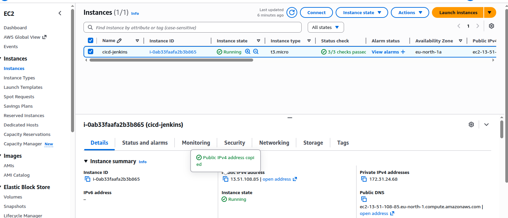

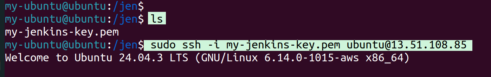

----------------------------------------
# step:2

Clone the code from GitHub.
List the files using ls.

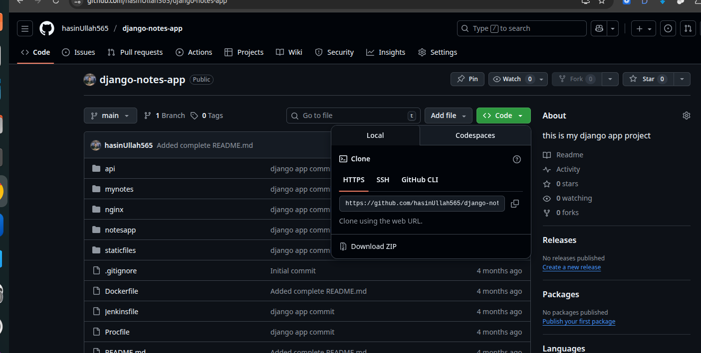

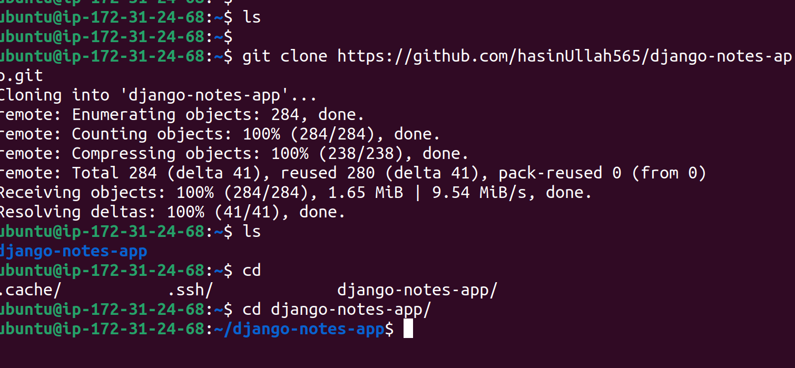
--------------------------------
# step:3 `install docker.io`

`sudo apt-get update`

`sudo docker install docker.io`


`docker ps'
error 
'sudo usermod -aG docker $USER`
#refresh after adding user in docker group 
`newgrp docker`
`docker ps`

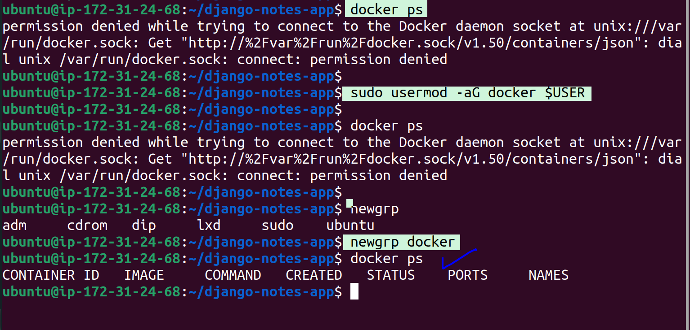
-------------------------------------

# step:4  build the docker images

View the Dockerfile contents:
`cat  Dockerfile`
`docker build -t  node-app1 .`

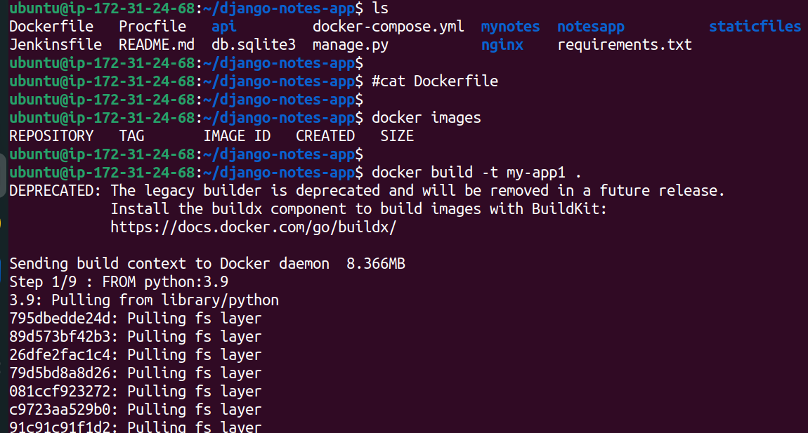
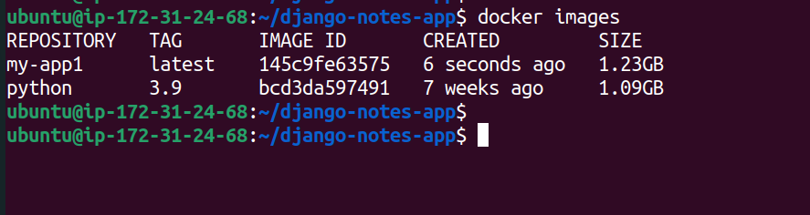
----------------------------------

# Step 5: Install Java

Before installing Jenkins, install Java because Jenkins requires Java to run.

```bash
sudo apt update
sudo apt install openjdk-11-jdk -y
java -version

# Install Jenkins
#Import the GPG key and Install Jenkins

```bash
#Import the GPG key
curl -fsSL https://pkg.jenkins.io/debian-stable/jenkins.io-2023.key | sudo tee /usr/share/keyrings/jenkins-keyring.asc > /dev/null

#Add Jenkins repository
echo deb [signed-by=/usr/share/keyrings/jenkins-keyring.asc] https://pkg.jenkins.io/debian-stable binary/ | sudo tee /etc/apt/sources.list.d/jenkins.list > /dev/null

#Update package list
sudo apt update

#Install Jenkins
sudo apt install jenkins -y

#Start Jenkins service
sudo systemctl start jenkins

#Check Jenkins status
sudo systemctl status jenkins

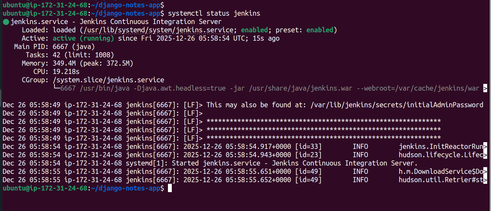
----------------------------------

#Configure AWS Security Group

- Go to your `AWS` EC2 Security Group settings.
- Allow inbound traffic on **port 8080**, which Jenkins uses.
---------------------------------------

# Access Jenkins

- Open your web browser and go to:  

http://<EC2-Public-IP>:8080

Jenkins Initial Admin Password
The Jenkins initial admin password is stored at:
`sudo cat /var/lib/jenkins/secrets/initialAdminPassword`

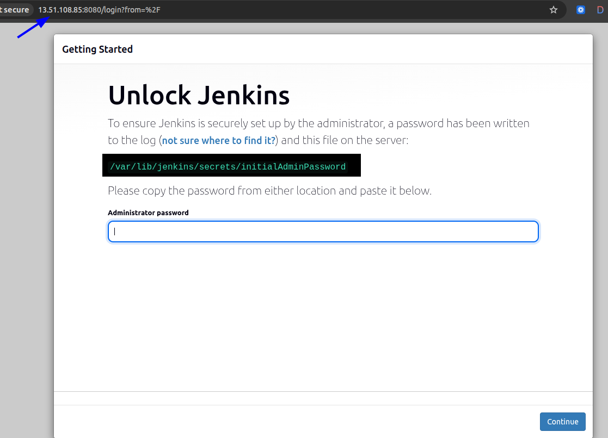

# install suggest plugins

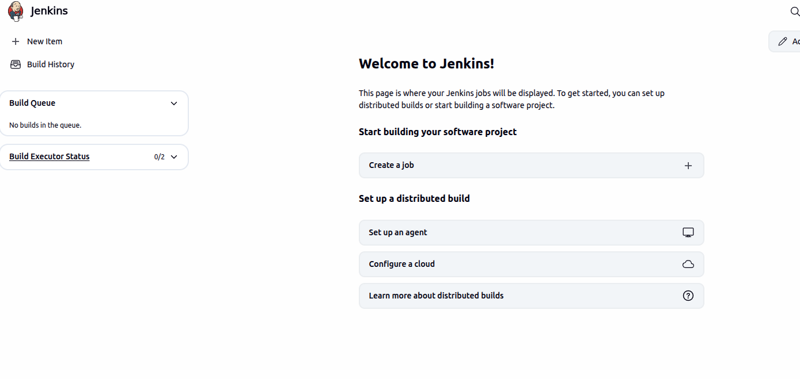
-----------------------------------

# step6: create the pipeline

1. Go to **Jobs** in Jenkins.
2. Click **Create**.
3. Select **Pipeline**.
4. Enter your GitHub project URL in the **Repository URL** field
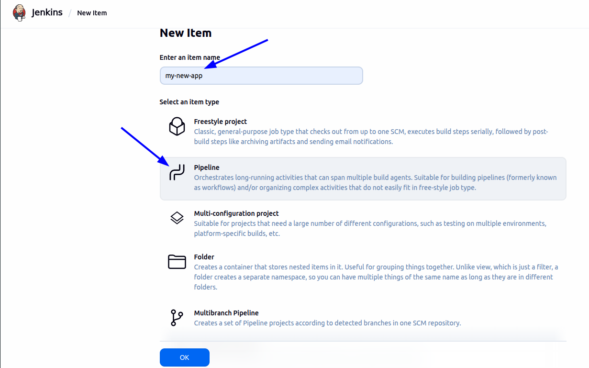

start writing the declerative pipelines.
what is pipeline?
Pipeline is a step-by-step automated process that takes your code
from development` → testing → building → deployment `automatically.
Jenkins Pipeline = Groovy-based script

pipeline {
    agent any

    stages {
        stage('Clone GitHub') {
            steps {
                // Clone the GitHub repository
                git 'https://github.com/hasinUllah565/django-notes-app.git'
            }
        }

        stage('Build Docker Image') {
            steps {
                // Build Docker image
                sh 'docker build -t my-app1 .'
            }
        }

        stage('Deploy App') {
            steps {
                // Run Docker container
                sh 'docker run -d -p 8000:8000 my-app1'
            }
        }
    }
}

---------------------------------------

# Step 7: Build the Pipeline

1. Click **Build Now** in Jenkins.
2. Open the **Console Output** to see the build logs and status.
3. You will see each stage executing:
   - Cloning GitHub repository
   - Building Docker image
   - Deploying the application

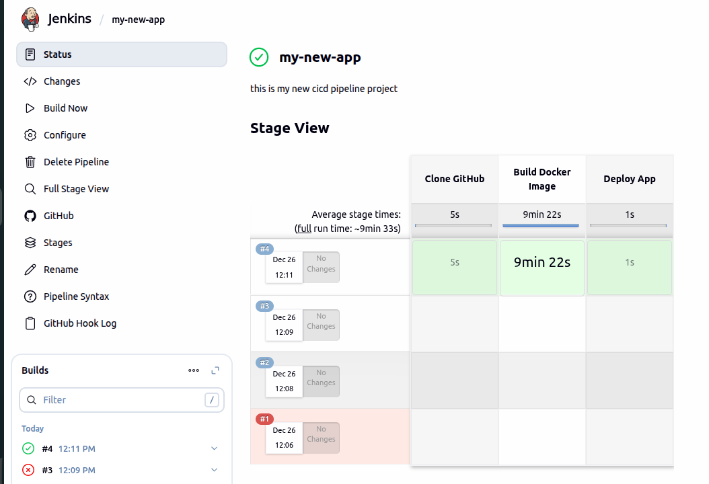

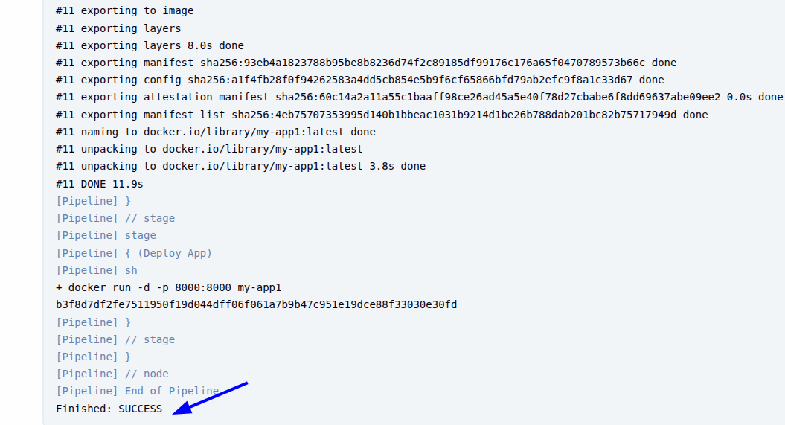

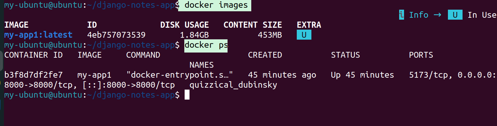

-------------------------------------
# step 8: Push Docker Image to Docker Hub

--> 1: Login to Docker Hub
```bash
docker login


go to `Jenkins Dashboard` → `Manage Jenkins → Manage` `Credentials`
##Create credentials in Jenkins to push images to Docker Hub

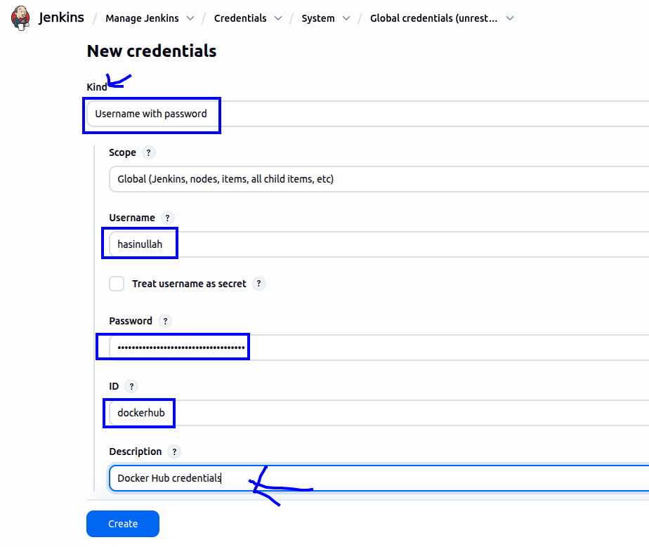

## add jenkins user in docker group
`sudo usermod -aG docker jenkins`
`sudo systemctl restart jenkins`


-------------------------------------
# step8: push to docker pipeline

#add credential in pipeline to automate 


pipeline {
    agent any

    stages {
        stage('Clone GitHub') {
            steps {
                git url:'https://github.com/hasinUllah565/django-notes-app.git' ,branch: "main"
            }
        }

        stage('Docker Login') {
            steps {
                withCredentials([usernamePassword(
                    credentialsId: 'dockerhub', 
                    usernameVariable: 'DOCKER_USER', 
                    passwordVariable: 'DOCKER_PASS')]) {
                    
                    sh 'echo $DOCKER_PASS | docker login -u $DOCKER_USER --password-stdin'
                }
            }
        }

        stage('Build Docker Image') {
            steps {
                sh 'docker build -t my-app1 .'
            }
        }

        stage('Deploy App') {
            steps {
                sh 'docker run -d -p 8000:8000 my-app1'
            }
        }

        stage('Push to Docker Hub') {
            steps {
                withCredentials([usernamePassword(
                    credentialsId: 'dockerhub', 
                    usernameVariable: 'DOCKER_USER', 
                    passwordVariable: 'DOCKER_PASS')]) {
                    
                    sh 'docker tag my-app1 $DOCKER_USER/my-app1:latest'
                    sh 'docker push $DOCKER_USER/my-app1:latest'
                }
            }
        }
    }
}


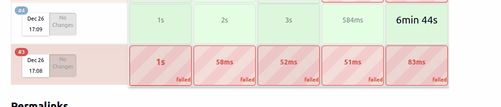

--------------------------------


#if you try again to build ,run,push, it will show you the erro `port allocate`

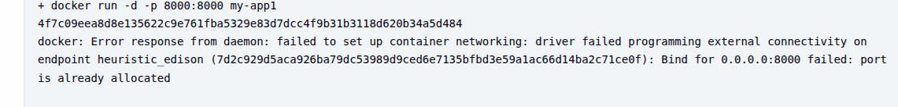

---------------------------------

# step 9:
If the port is already in use, we should run `docker-compose down` followed by `docker-compose up` in the pipelineb 'deploy section' . This ensures the old container is removed before starting a new one
``
stage('Deploy App') {
            steps {
                sh 'docker-compose down'
                sh 'docker-compose up -d'
``

then `build`

now it will not show `port already allocate error`.

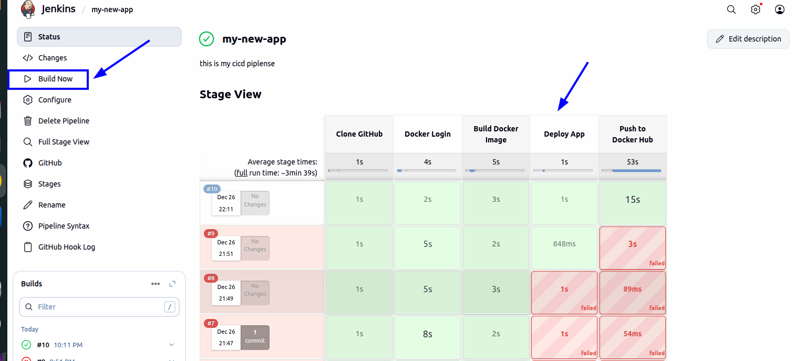

------------------------------------------

# step 10:

configure the webhoosk 

what is webhook ?
A webhook is a way for one application to automatically send real-time data or notifications to another application when a specific event happens.

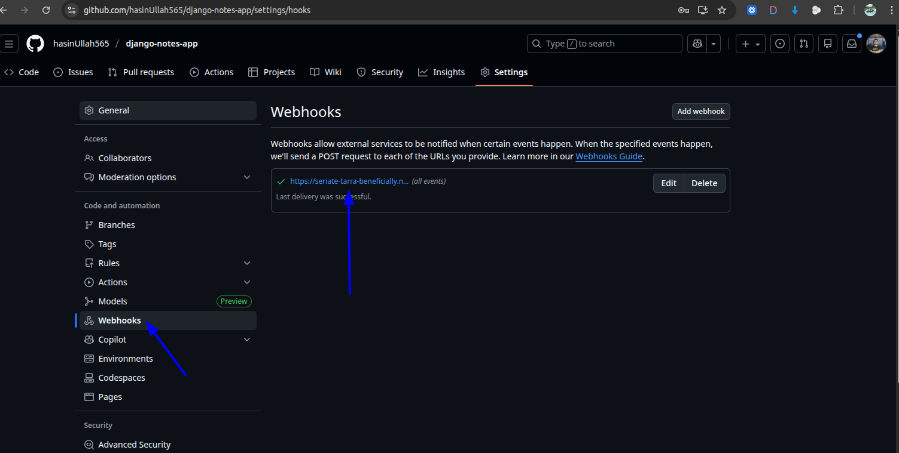


Now, whenever you commit something to the GitHub repository, it will automatically trigger Jenkins to build and run your application


## Author

**Hasin Ullah** - [GitHub](https://github.com/hasinUllah565)


